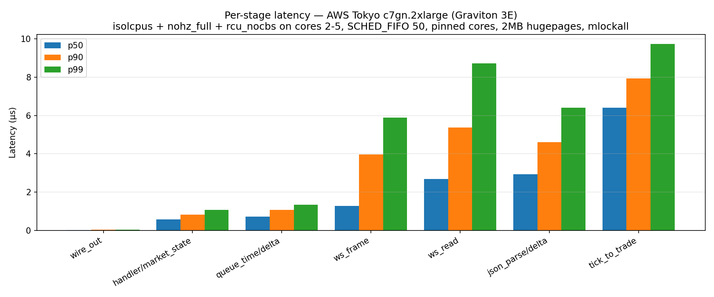
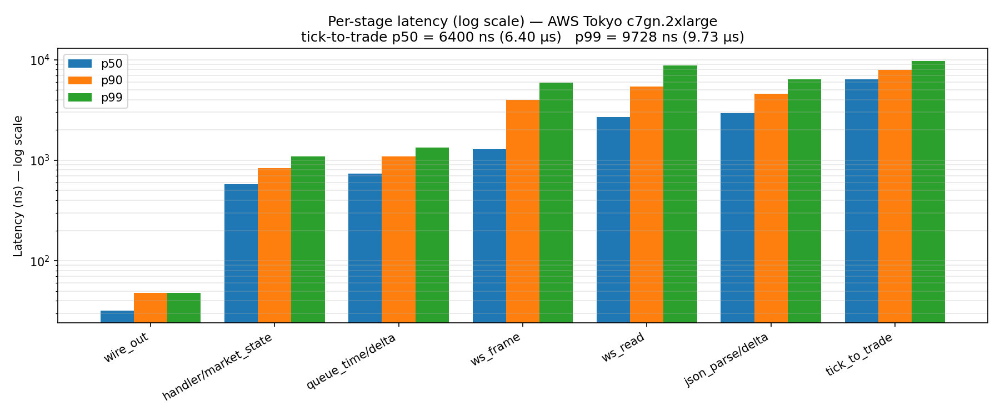
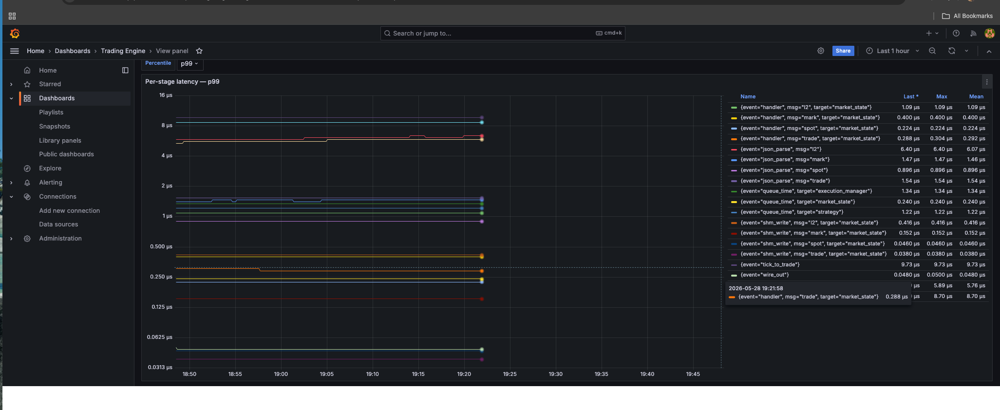

# Low-Latency C++ Cross-Venue Quoter & Microstructure Simulator

A from-scratch C++20 trading stack for Delta Exchange (crypto derivatives perpetuals), engineered as a portfolio piece for low-latency HFT / market-making systems work. Single-threaded poll-mode reactors, lock-free rings between threads, integer-tick-space orderbook, `rdtscp` instrumentation across the full wire-to-wire path, deployed on AWS Tokyo Graviton.

The strategy is intentionally simple. The point is the systems work underneath it.



> **Measured tick-to-trade — AWS Tokyo `c7gn.2xlarge` (Graviton 3E, Neoverse-V1), 2026-05-28, n = 1,694**
>
> **p50 = 6.40 µs · p90 = 7.92 µs · p99 = 9.73 µs**
>
> Linux: `isolcpus` + `nohz_full` + `rcu_nocbs` on cores 2-5 · 2 MB hugepages × 1024 · `SCHED_FIFO` prio 50 on hot threads · IRQ affinity off isolated cores · `mlockall`.

---

## Status

This repo is in active development. Honest summary of what is and isn't built:

### Phase 1 — Deployed, measured, alive ✅
- [x] C++20 stack — epoll reactor, OpenSSL TLS WebSocket from scratch, integer-tick-space orderbook with snapshot + incremental reconciliation
- [x] Lock-free SPSC / SPMC rings between threads; SeqLock snapshot publication
- [x] Multi-process: separate Delta feed and OMS processes via `fork()`, communicating via shared memory
- [x] OMS — order/position/wallet state machines, REST signing, audit log, 8-scenario end-to-end testnet test passing
- [x] `rdtscp`-based latency instrumentation across 5 stages (`ws_read` → `ws_frame` → `json_parse` → `handler` → `queue_time` → `wire_out` → `tick_to_trade`)
- [x] Per-thread histograms, periodic push to InfluxDB, Grafana dashboard
- [x] AWS Tokyo deployment — see [`DEPLOY_AWS.md`](DEPLOY_AWS.md)
- [x] Placeholder fixed-spread quoter on a shadow execution path (signs and builds the REST body, then logs instead of `send()`-ing)

### Phase 2 — In progress 🚧
- [ ] **Bybit V5 WS client** (OB200 + `publicTrade`) — second venue, for the lead-lag signal
- [ ] **Queue-position-aware orderbook** — per-level `total_volume` / `our_volume` / `est_volume_ahead`, cancel-flow heuristic derived from L2 deltas
- [ ] **Three-mode fill simulator** — optimistic / pessimistic / probabilistic-with-Poisson-cancel-flow
- [ ] **Microprice + OFI quoter** — Stoikov microprice, Cont-Kukanov order-flow imbalance, replacing the placeholder
- [ ] **Tick recorder + deterministic replayer** — binary `FeedMessage` dump and a `make replay-determinism` target asserting byte-identical books across runs
- [ ] Adverse-selection guard + production risk overlays (daily-loss kill, stale-feed kill, spread blowout)
- [ ] Cachegrind pass on hot paths

See [`LIMITATIONS.md`](LIMITATIONS.md) for what this repo does **not** model and what the measurement does **not** claim.

---

## The latency table

| Stage | What it measures | p50 | p90 | p99 |
|---|---|---:|---:|---:|
| `ws_read` | `SSL_read` returns one TCP record | 2.68 µs | 5.36 µs | 8.72 µs |
| `ws_frame` | RFC 6455 frame parse (mask/length/opcode) | 1.28 µs | 3.96 µs | 5.87 µs |
| `json_parse/delta` | `simdjson` ondemand walk of one L2 update | 2.92 µs | 4.58 µs | 6.40 µs |
| `handler/market_state` | Apply update to `OrderBook<10>` in tick space | 0.58 µs | 0.84 µs | 1.08 µs |
| `queue_time/delta` | SPSC ring traversal (feed → market_state thread) | 0.72 µs | 1.08 µs | 1.34 µs |
| `wire_out` | Strategy-decision → bytes-on-wire (shadow path) | 0.03 µs | 0.05 µs | 0.05 µs |
| **`tick_to_trade`** | **Post-`SSL_read` userspace timestamp → quote-intent-emitted, end-to-end** | **6.40 µs** | **7.92 µs** | **9.73 µs** |

Raw CSV: [`docs/data/aws_tokyo_2026-05-28.csv`](docs/data/aws_tokyo_2026-05-28.csv). Generate the charts with `python3 scripts/plot_latency.py docs/data/aws_tokyo_2026-05-28.csv`.



Live Grafana view during the run:



---

## Architecture

Two child processes spawned via `fork()` in [`src/main.cpp`](src/main.cpp). The feed process owns the public-market-data path; the OMS process owns everything from book-snapshot read through wire-out. They do not communicate with each other directly — the feed publishes a `SeqLock` snapshot into shared memory, and the OMS process reads it.

```
┌─────────────────────────────────────┐   ┌──────────────────────────────────────┐
│           feed process              │   │            oms process               │
│                                     │   │                                      │
│   thread 1 — epoll reactor          │   │   thread 1 — epoll reactor           │
│     · DeltaWebsocketClient::start   │   │     · DeltaOMSWebsocketClient        │
│     · L2 / mark / spot / OHLC       │   │     · orders / positions / wallet    │
│     ↓ FeedMessage                   │   │     ↓ OMSEvent                       │
│     SpscRing<FeedMessage, 4096>     │   │     SpscRing<OMSEvent, 256> × 3      │
│     ↓                               │   │     ↓                                │
│   thread 2 — MarketState::run       │   │   thread 2 — OrderStateManager       │
│     · maintains OrderBook<10>       │   │     · channel state machines         │
│     · OHLCRing per resolution       │   │     · MemoryPool<Order, 64>          │
│     · writes SeqLock snapshot ─────►│SHM│   reads positions / wallet           │
│                                     │   │                                      │
│                                     │SHM├─►  thread 3 — Strategy::run          │
│                                     │   │     · reads SeqLock snapshot         │
│                                     │   │     · quoter → ExecutionIntent       │
│                                     │   │     ↓                                │
│                                     │   │     SpscRing<ExecutionIntent>        │
│                                     │   │     ↓                                │
│                                     │   │   thread 4 — ExecutionManager::run   │
│                                     │   │     · REST client (HMAC-SHA256)      │
│                                     │   │     · wire-out                       │
└─────────────────────────────────────┘   └──────────────────────────────────────┘
```

Hot paths use CRTP for compile-time polymorphism — `WebSocketClient<Derived>`, `Session<DerivedSession, ClientDerived>`, `OrderBook<Depth>` — so there's no virtual dispatch on the wire path.

Single-writer SPSC rings carry events between threads (acquire/release on `head_`, per-slot cache-line padding to avoid false sharing). The feed → OMS handoff goes through a `SeqLock<T>` in shared memory: the writer never blocks, the reader is wait-free, and the snapshot type is trivially copyable.

Prices live in **integer tick space** — `Tick = int64_t`, `tick = price * inv_tick_size` computed once at parse time. No floating point on the hot path.

---

## What's in the box

- `src/transport/` — TLS WebSocket from scratch (RFC 6455 frame encode/decode, masking, fragmentation), epoll reactor with `timerfd` heartbeat and `eventfd` shutdown
- `src/core/` — `SpscRing`, `SpmcRing`, `SeqLock`, `MemoryPool`, `Logger`, `cpu_pin`
- `src/core/orderbook/` — `OrderBook<Depth>` in tick space
- `src/delta_exchange/` — feed sessions (L2, mark, spot, OHLC), OMS sessions (orders, positions, wallet), REST client with HMAC-SHA256 signing, product table
- `src/market_state/` — drains the feed ring, maintains books + OHLC rings, writes to SHM
- `src/oms/` — `OrderStateManager`, channel state machines (Invalid → Rebuilding → Valid), audit log
- `src/latency/` — `rdtscp` clock + calibration, log-bucket histogram, RAII `Span`, periodic InfluxDB push
- `src/strategy/` — placeholder fixed-spread quoter, risk overlay scaffolding, `strategy_config`
- `src/ipc/` — `ShmOwner` / `ShmAccessor`, `SharedState` layout
- `src/processes/` — `feed`, `oms`, `strategy` process wrappers

Phase 2 will add `src/bybit/`, `src/simulator/`, `src/replay/`, and replace the placeholder quoter with a real microprice + OFI implementation.

---

## Quickstart (local, shadow mode)

Tested on Ubuntu 24.04 / Debian 12. macOS won't build the production stack (depends on `epoll`, `timerfd`, `eventfd`, `shm_open`) — use the Docker dev environment instead.

### Prerequisites

```bash
sudo apt-get install -y \
  build-essential cmake git \
  libssl-dev libboost-dev \
  pkg-config
```

### Build

```bash
git clone https://github.com/samkitjain/trading-bot.git
cd trading-bot
mkdir -p build && cd build
cmake -DCMAKE_BUILD_TYPE=Release -DPORTABLE_RELEASE=ON ..
cmake --build . -j$(nproc)
```

Sanitizer builds:

```bash
cmake -DCMAKE_BUILD_TYPE=Debug ..             # AddressSanitizer + UBSan
cmake -DCMAKE_BUILD_TYPE=ThreadSanitizer ..   # TSan
```

Unit tests:

```bash
cmake -DBUILD_TESTS=ON ..
cmake --build . -j$(nproc) && ctest --output-on-failure
```

### Configure

Copy `.env.example` to `.env` and fill in Delta credentials (testnet recommended). The bot supports two environments:

- **Testnet** — WS `socket-ind.testnet.deltaex.org`, REST `cdn-ind.testnet.deltaex.org`
- **Production** — WS `socket.india.delta.exchange`, REST `api.india.delta.exchange`

The OMS layer ships with a shadow execution mode that signs HMACs and builds the REST body, then logs the request instead of sending it. Use that until you're sure.

### Run

```bash
./build/trading_bot
```

You should see four `[pin]` lines confirming each hot thread got pinned to its core and promoted to `SCHED_FIFO 50`. If you see `WARN SCHED_FIFO(50) failed`, run as root or grant `CAP_SYS_NICE`.

### Docker dev environment

```bash
docker compose up -d --build
docker compose exec -it trading-bot bash
```

The compose file also starts InfluxDB (latency metrics sink) and Grafana (dashboard). Default credentials: `admin/admin`, bucket `latency`, org `trading`, token `dev-trading-bot-token`.

---

## Reproducing the AWS Tokyo measurement

The 6.40 µs / 9.73 µs numbers above are reproducible. The full step-by-step — EC2 provisioning, GRUB cmdline, IRQ affinity, the 15+ pitfalls hit during the first deploy and their fixes — is in [`DEPLOY_AWS.md`](DEPLOY_AWS.md).

Headline: `c7gn.2xlarge` Graviton 3E in `ap-northeast-1`, Ubuntu 24.04 ARM, isolcpus / nohz_full / rcu_nocbs on cores 2-5, 2 MB hugepages, SCHED_FIFO prio 50 on hot threads, bot pinned native (not Docker), Influx + Grafana in Docker on the housekeeping cores.

---

## Latency methodology

- **Clock**: `rdtscp` on ARM (uses `cntvct_el0` via the kernel-exposed counter), calibrated at startup against `CLOCK_MONOTONIC` over a 100 ms window. Methodology dump on stdout at boot.
- **Spans**: RAII `Span` records start TSC in its constructor and the delta-cycles into a log-bucket histogram in its destructor. Inlined; ~15 lines.
- **Histograms**: 64 log-spaced buckets per (thread × event × target × venue) tag. Each thread writes to its own histogram (no contention); a low-priority thread on a housekeeping core periodically reads, computes p50/p90/p99/count, and POSTs to InfluxDB.
- **Hot threads never block on the metrics path.** The push thread is created *before* the hot thread's CPU pin + `SCHED_FIFO` promotion so it doesn't inherit either, and is then explicitly pinned to cores 0-1 with `SCHED_OTHER`. Otherwise the push thread starves and stops scheduling against the isolated cores.
- **What "tick" means here.** The starting timestamp for `tick_to_trade` is a userspace `cntvct_el0` read taken **immediately after `SSL_read` returns** in the WS reactor. It is **not** a hardware/`SO_TIMESTAMPING` receive timestamp — by the time we stamp it, the kernel network stack and OpenSSL record decryption have already run. The number therefore reflects what userspace code can do once the bytes are in hand; it does not measure NIC-to-userspace.
- **Sample size**: `n = 1,694` `tick_to_trade` samples gathered over a ~15-minute run on live Delta testnet feeds. This is enough to land p50/p90 stably; treat p99.9 / max as exploratory.

---

## Repo layout

```
src/
  main.cpp                       process entry; forks feed + oms
  core/                          spsc/spmc ring, seqlock, memory pool, cpu pin, orderbook
  transport/                     epoll WS + HTTPS, RFC 6455 framing, session lifecycle
  delta_exchange/                Delta WS clients, REST, API serializers, product table
    sessions/                    L2, mark, spot, OHLC; orders, positions, wallet
    api/                         per-endpoint Request structs (serialize + parse)
    models/                      Product, Order, Position, Fill, Wallet (trivially copyable)
  market_state/                  drains feed ring, maintains books + OHLC, writes SHM
  oms/                           OrderStateManager, audit log, reconciler
  ipc/                           shared memory wrappers, SharedState layout
  latency/                       rdtscp clock, histogram, span, registry, Influx pusher
  strategy/                      placeholder quoter + risk overlay scaffolding
  processes/                     feed / oms / strategy process wrappers
tests/                           gtest unit tests + end-to-end OMS test
scripts/
  aws_tokyo_setup.sh             one-shot EC2 bootstrap
  sync_to_aws.sh                 rsync codebase to EC2 (excludes .env, build/, etc.)
  plot_latency.py                CSV → per-stage + log-scale PNGs
docs/
  img/                           latency charts + Grafana screenshots
  data/                          raw CSV snapshots
```

---

## Stack

| | |
|---|---|
| Language | C++20 |
| TLS | OpenSSL 3.x |
| WebSocket | RFC 6455, hand-rolled |
| HTTP | cpp-httplib 0.18.1 (FetchContent) |
| JSON | simdjson 3.12.2 ondemand (FetchContent) |
| Tests | GoogleTest 1.14.0 (FetchContent) |
| Build | CMake ≥ 3.20, gcc 11+ / clang 14+ |
| Telemetry | InfluxDB 2.x + Grafana via Docker Compose |
| Target OS | Linux only (epoll / timerfd / eventfd / shm_open / SCHED_FIFO) |

---

## License

MIT — see [`LICENSE`](LICENSE).

---

## Author

Samkit Jain — [linkedin.com/in/samkit21](https://www.linkedin.com/in/samkit21) · jsamkit21@gmail.com

4.5 years on the core scalability team at Delta Exchange (matching, cross-margin, market-maker protocols, gateway) before turning around to build the client side. This is the portfolio piece for that pivot.
